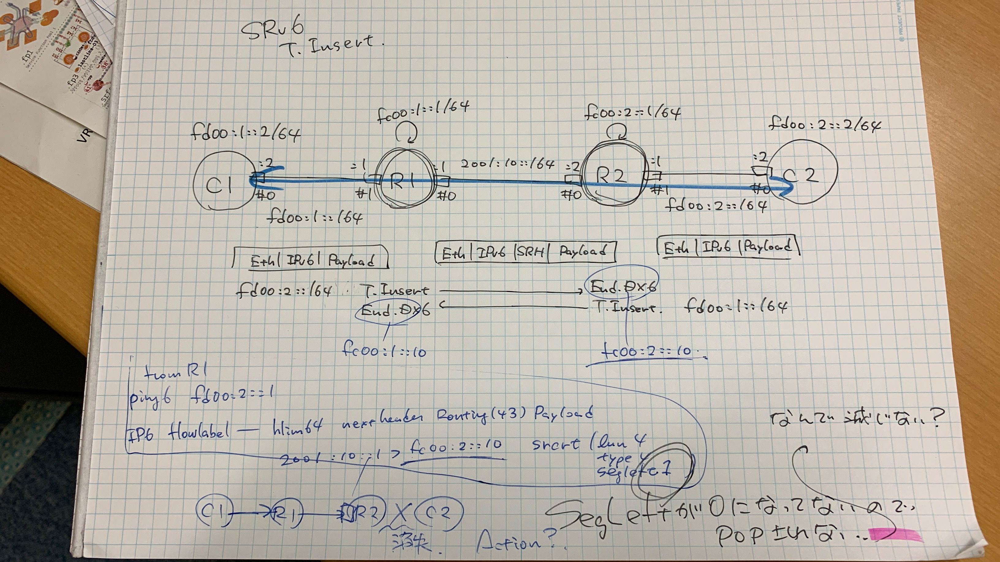

## T.Insertだと動かないぞい
C1からpingするとSegleft=0のSRH付きでC2に届いてしまう

### T.Insert->End
```
root@R1:/# ip -6 r
2001:10::/64 dev net0 proto kernel metric 256 pref medium
fc00:1::10  encap seg6local action End via fd00:1::2 dev net1 metric 1024 pref medium
unreachable fc00:1::/64 dev lo proto kernel metric 256 error -101 pref medium
fc00:2::/64 via 2001:10::2 dev net0 metric 1024 pref medium
fd00:1::/64 dev net1 proto kernel metric 256 pref medium
fd00:2::2  encap seg6 mode inline segs 2 [ fc00:2::10 :: ] dev net0 metric 1024 pref medium
fe80::/64 dev net0 proto kernel metric 256 pref medium
fe80::/64 dev net1 proto kernel metric 256 pref medium
```

### T.Encaps->End.DX6
```
root@R1:/# ip -6 r
2001:10::/64 dev net0 proto kernel metric 256 pref medium
fc00:1::10  encap seg6local action End.DX6 nh6 fd00:1::2 dev net1 metric 1024 pref medium
unreachable fc00:1::/64 dev lo proto kernel metric 256 error -101 pref medium
fc00:2::/64 via 2001:10::2 dev net0 metric 1024 pref medium
fd00:1::/64 dev net1 proto kernel metric 256 pref medium
fd00:2::2  encap seg6 mode encap segs 1 [ fc00:2::10 ] dev net0 metric 1024 pref medium
fe80::/64 dev net0 proto kernel metric 256 pref medium
fe80::/64 dev net1 proto kernel metric 256 pref medium
```
