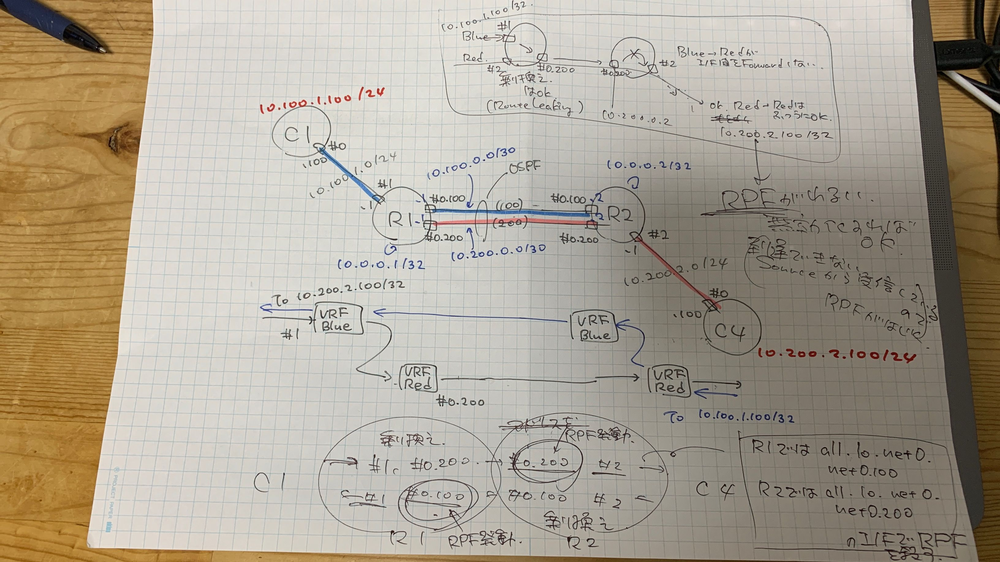

- VRF乗り換え自体はうまく動いているけど，乗り換えた先でインターフェイス間の転送がされない（R2でnet0.200からnet2に転送されない）
  - Red-Redの場合は転送もされる

### R1
```
07:59:53.557922 IP 10.100.1.100 > 10.200.2.100: ICMP echo request, id 149, seq 1, length 64
07:59:53.557942 IP 10.100.1.100 > 10.200.2.100: ICMP echo request, id 149, seq 1, length 64
07:59:53.557944 ethertype IPv4, IP 10.100.1.100 > 10.200.2.100: ICMP echo request, id 149, seq 1, length 64
07:59:54.564953 IP 10.100.1.100 > 10.200.2.100: ICMP echo request, id 149, seq 2, length 64
07:59:54.564983 IP 10.100.1.100 > 10.200.2.100: ICMP echo request, id 149, seq 2, length 64
07:59:54.564986 ethertype IPv4, IP 10.100.1.100 > 10.200.2.100: ICMP echo request, id 149, seq 2, length 64
07:59:55.588939 IP 10.100.1.100 > 10.200.2.100: ICMP echo request, id 149, seq 3, length 64
07:59:55.588982 IP 10.100.1.100 > 10.200.2.100: ICMP echo request, id 149, seq 3, length 64
07:59:55.588985 ethertype IPv4, IP 10.100.1.100 > 10.200.2.100: ICMP echo request, id 149, seq 3, length 64

08:00:06.549292 ethertype IPv4, IP 10.200.2.100 > 10.100.1.100: ICMP echo request, id 53, seq 1, length 64
08:00:06.549292 IP 10.200.2.100 > 10.100.1.100: ICMP echo request, id 53, seq 1, length 64
08:00:07.556914 ethertype IPv4, IP 10.200.2.100 > 10.100.1.100: ICMP echo request, id 53, seq 2, length 64
08:00:07.556914 IP 10.200.2.100 > 10.100.1.100: ICMP echo request, id 53, seq 2, length 64
08:00:08.580890 ethertype IPv4, IP 10.200.2.100 > 10.100.1.100: ICMP echo request, id 53, seq 3, length 64
08:00:08.580890 IP 10.200.2.100 > 10.100.1.100: ICMP echo request, id 53, seq 3, length 64
```

### R2
```
07:59:53.557944 ethertype IPv4, IP 10.100.1.100 > 10.200.2.100: ICMP echo request, id 149, seq 1, length 64
07:59:53.557944 IP 10.100.1.100 > 10.200.2.100: ICMP echo request, id 149, seq 1, length 64
07:59:54.564987 ethertype IPv4, IP 10.100.1.100 > 10.200.2.100: ICMP echo request, id 149, seq 2, length 64
07:59:54.564987 IP 10.100.1.100 > 10.200.2.100: ICMP echo request, id 149, seq 2, length 64
07:59:55.588988 ethertype IPv4, IP 10.100.1.100 > 10.200.2.100: ICMP echo request, id 149, seq 3, length 64
07:59:55.588988 IP 10.100.1.100 > 10.200.2.100: ICMP echo request, id 149, seq 3, length 64

08:00:06.549273 IP 10.200.2.100 > 10.100.1.100: ICMP echo request, id 53, seq 1, length 64
08:00:06.549291 IP 10.200.2.100 > 10.100.1.100: ICMP echo request, id 53, seq 1, length 64
08:00:06.549292 ethertype IPv4, IP 10.200.2.100 > 10.100.1.100: ICMP echo request, id 53, seq 1, length 64
08:00:07.556885 IP 10.200.2.100 > 10.100.1.100: ICMP echo request, id 53, seq 2, length 64
08:00:07.556911 IP 10.200.2.100 > 10.100.1.100: ICMP echo request, id 53, seq 2, length 64
08:00:07.556913 ethertype IPv4, IP 10.200.2.100 > 10.100.1.100: ICMP echo request, id 53, seq 2, length 64
08:00:08.580865 IP 10.200.2.100 > 10.100.1.100: ICMP echo request, id 53, seq 3, length 64
08:00:08.580887 IP 10.200.2.100 > 10.100.1.100: ICMP echo request, id 53, seq 3, length 64
08:00:08.580889 ethertype IPv4, IP 10.200.2.100 > 10.100.1.100: ICMP echo request, id 53, seq 3, length 64
```
